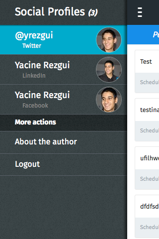
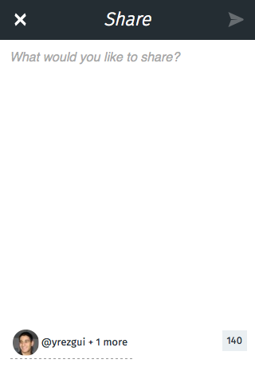

# Buffer for Firefox OS


### How to setup the development environment

1. Install ```Firefox```
2. Install [Redirector](https://addons.mozilla.org/en-US/firefox/addon/redirector/) extension to simulate the [redirect feature](https://developer.mozilla.org/en-US/Apps/Build/Manifest#redirects) of Firefox OS apps
	1. Create a new rule
	2. ```Include pattern``` should be like that : http://www.fakedomain.com/oauth-callback/* (This URL must be the same as defined in your Buffer developer dashboard)
	3. ```Redirect to``` must be like that : [http://localhost:8000/www/index.html#/start$1](http://localhost:8000/www/index.html#/start$1)
3. Follow instructions of the backend (OAuth token exchange + CORS proxy for testing on desktop) : https://github.com/yrezgui/buffer-login-backend
5. Install ```nodejs```
6. Install ```bower```
7. Launch this command ```npm install && bower install```
8. Launch ```gulp``` in the root folder of the app
9. Start ```python -m SimpleHTTPServer``` in the root folder of the app
10. Go to this address [http://localhost:8000/www/](http://localhost:8000/www/)


### Screenshots






### TO DO

1. Add animations to make it smooth
2. Deploy it on the FirefoxOS marketplace (I'm waiting my flame to try on it first)
3. Use MozSystem property instead of local CORS proxy
4. Be able to edit posts
5. Add scheduling for sharing post (Buffering is the only option now)
6. Display media objects
7. Add media objects when sharing a post
8. Add Web Activity to allow sharing from other apps
